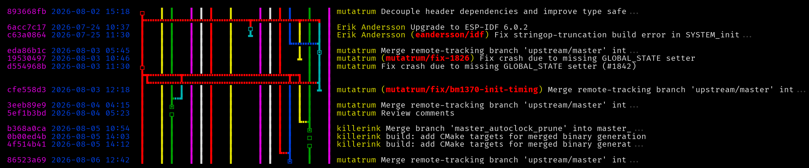

# git-rivera/git-河流

[git-foresta](https://github.com/takaaki-kasai/git-foresta) in go



## features/differences from git-foresta

- the graph is reversed by default, with the root at the top and tip(s) at the bottom
- persistent branch coloring
- `--repository` option to pass a path (no more needing to `cd` beforepaw)
- more control over overpasses (no more ODODO -> OOOOO)
  ex: overpass becomes `======` instead of `=-=-=-`
- accepts git args (`git-rivera --rivera-arg -- --git-arg, --git-arg-2`)

## install

```sh
go install git.0xf0xx0.eth.limo/0xf0xx0/git-rivera@latest
```

### from source

```sh
git clone https://git.0xf0xx0.eth.limo/0xf0xx0/git-rivera.git
cd rivera
go build
go install
```

## usage

with git:

```sh
git rivera
```

or use it standalone:

```sh
git-rivera
```

## options

```
    --repository path, --repo path          repository path to use (default: ".")
    --start commithash                      commithash to start at
    --end commithash                        commithash to end at
    --hashlength len, --hashlen len, -l len length of the commit hash (min: 4) (default: 8)
    --messagelength len, --msglen len       length of the commit message (default: 50)
    --style num, -s num                     style num to select (1-5) (default: 1)
    --subvinedepth uint, --svdepth uint     maximum length of merge subvines (default: 2)
    --graphmarginleft uint, --marginl uint  left margin of the commit graph (default: 2)
    --graphmarginright uint, --marginr uint right margin of the commit graph (default: 1)
    --all, -a                               display all branches
    --smooth-overpass                       convert ODODO overpasses to OOOOO
    --reverse, -r                           reverse the flow
    --status                                display the git status
    --branchcolors color,color[,color]      comma separated color,color[,color] used for branches, passed straight to oigiki (default: "red, blue, yellow, green, cyan, magenta, white")
    --maxgitrecursedepth uint, --mgrd uint  maximum depth to search for a .git dir (default: 8)
    --help, -h                              show help
    --version, -v                           print the version
    --color                                 force color output
    --nocolor, --stdout                     disable color output
```

## custom graph chars `--customstyle`

- `A`: branch to right
- `B`: branch to left
- `C`: commit
- `M`: merge commit
- `D`: overpass over empty space
- `e`: merge visual left (╔)
- `f`: merge visual center (╦)
- `g`: merge visual right (╗)
- `I`: straight line (║)
- `K`: branch visual split (╬)
- `m`: single line (─)
- `O`: overpass (≡)
- `r`: root (╙)
- `t`: tip (╓)
- `x`: branch visual left (╚)
- `y`: branch visual center (╩)
- `z`: branch visual right (╝)
- `*`: filler

## todo

- finish compat
